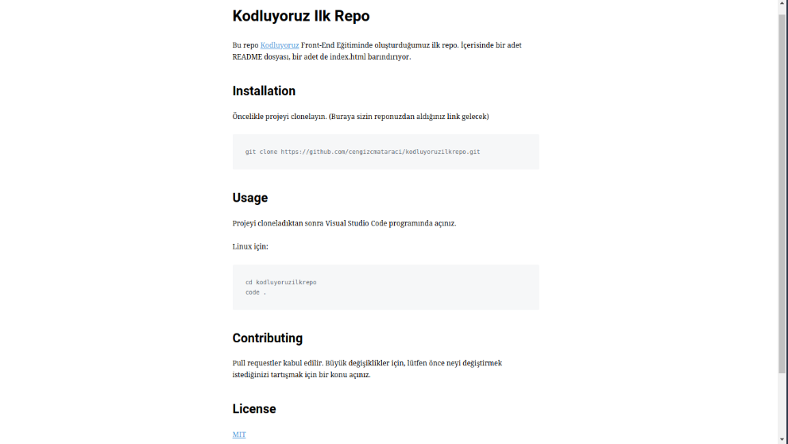

# Kodluyoruz Ilk Repo
Bu repo [Kodluyoruz](https://www.kodluyoruz.org/programlar) Front-End egitiminde olusturdugumuz ilk repo,icerisinde bir adet README.md dosyasi, bir adet de index.html barindiriyor.
-------------------------

-------------------------

## Installation
Oncelikle projeyi clonelayin.

` git clone https://github.com/EDilaraK/kodluyoruzilkrepo.git `
## Usage
Projeyi cloneladiktan sonra Visual Studio Code programina aciniz.
Linux icin:
`cd kodluyoruzilkrepo code .`
## Contributing
Pull requestler kabul edilir. Buyuk degisiklikler icin, lutfen once neyi degistirmek istediginizi tartismak icin bir konu aciniz.
## License
[MIT](LICENSE)